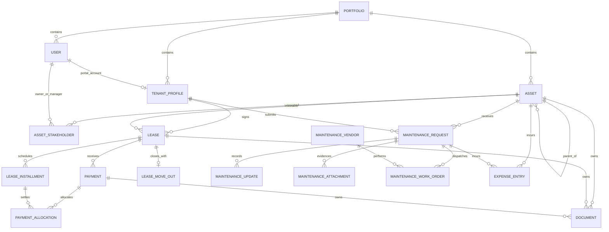

# Property Management Control: Current System Report

**Report date:** August 11, 2026  
**Application build revision:** `1451c25fcf3076fff2cda96e96c498156b0dd95f`
**Production URL:** `https://property.ahmaddalao.com`  
**Assessment:** Operational MVP release candidate; not yet approved for an unattended real-property launch.

## 1. Executive Status

The repository contains a broad, working property-operations platform rather than a prototype. It covers portfolio and property setup, a hierarchical property/unit model, owner and manager assignments, tenant onboarding, leases, installment schedules, manual payment allocation, collection follow-up, expenses, maintenance requests, contractors and work orders, PDF records, reporting, CMS, bilingual wording, audit history, backups, and launch-readiness controls.

The application code is healthy. The release reran the complete PHP suite: **644 tests and 37,255 assertions passed**. The release baseline also includes 69 passing Playwright/axe scenarios, TypeScript, ESLint, Prettier, Pint, Vite, route, migration, and touched-module PHPStan checks.

The verified release is deployed to Hostinger and matches GitHub. The live site responds successfully at `/up`, `/system/settings` is active, a pre-migration backup completed, and authenticated EN/AR dashboard, reports, CMS, PDF, and XLSX smoke checks passed. SMTP, the one-minute Hostinger scheduler, a reconciled real opening-data import, approved legal wording, and the four-role pilot remain launch blockers.

### Current verdict

| Area | State | Comment |
|---|---|---|
| Core domain workflows | Ready for pilot | Property through payment and maintenance workflows exist and are tested. |
| Authorization | Strong, complex | Role, portfolio, module, and assigned-property scopes are enforced and heavily tested. |
| Responsive UI | Release baseline passes | Desktop tables and mobile cards are implemented; automated widths cover 390/768/1024/1440. |
| English/Arabic | Implemented | UI dictionaries, RTL, bilingual records, PDFs, DOCX, XLSX, CMS, and wording overrides exist. |
| Reporting | Operational | Real `.xlsx`, PDF, and DOCX outputs exist; unlike currencies remain separated. |
| Email | Blocked in production | Live mailer was last recorded as `log`; SMTP receipt is unproven. |
| Scheduler/queue | Blocked in production | Code is ready, but no three-heartbeat production evidence exists. |
| Real portfolio data | Not started | Production has showcase data but no approved live portfolio import. |
| Legal/compliance approval | Owner action required | Lease wording, billing rules, retention, and opening balances need business/legal sign-off. |
| Latest deployment | Current | GitHub and Hostinger run the verified release; the production manifest matches the local build. |

## 2. Audit Scope And Method

This report was built from the current source, route registry, request validation, access classes, presenters, React modules, model relationships, scheduler, package manifests, existing release evidence, and a fresh test run. It distinguishes three things:

- **Implemented:** present in source and covered by the current application architecture.
- **Production active:** verified on the live Hostinger deployment.
- **Operationally approved:** proven with real users, reconciled real data, and business evidence.

Those states are not interchangeable. The code can be complete while the deployment is still not safe to call live-ready.

## 3. Architecture

| Layer | Technology and design |
|---|---|
| Framework | Laravel `13.17`, PHP `^8.4.1`, server-rendered Laravel entry with Inertia responses. |
| Frontend | React `19.2`, TypeScript `5.7`, Inertia React `3`, Bootstrap `5.3.8`, Bootstrap Icons, custom modular CSS, Vite `8.1.3`. |
| Production rendering | Laravel monolith. Vite builds static browser assets; no Node server is required in production. |
| Backend organization | Thin HTTP controllers over vertical modules in `app/Modules/*`: Actions, Queries, Presenters, Requests, Support, Jobs, and Data objects. |
| Frontend organization | Thin Inertia page entries under `resources/js/pages/*`; feature UI under `resources/js/modules/*`; shared data-table, operations, resource-cycle, shell, and translation components. |
| Database | MySQL in production. Local audit environment currently uses SQLite. Eloquent models and migrations are the schema source. |
| Authentication | Laravel session authentication, password reset tokens, remember-me, login throttling, active-account enforcement, and forced permanent-password change. |
| Authorization | Spatie Laravel Permission plus feature access classes, portfolio scoping, portfolio module toggles, and manager assigned-property scoping. |
| Session/cache/queue | Database-backed on shared hosting. Queue workers are short-lived and invoked by the scheduler. No Redis, Horizon, or Supervisor is required. |
| Files | Private local storage for contracts, documents, evidence, backups, and reports; public storage for approved media. Shared-hosting storage mirror command exists. |
| Documents | Dompdf with Arabic shaping for PDFs; internal OOXML builders for real DOCX and XLSX packages. |
| Mapping | Leaflet `1.9.4`, Leaflet MarkerCluster `1.5.3`, configurable OpenStreetMap tile URL and attribution. |
| Activity history | Spatie Activitylog plus explicit operational timelines and immutable collection follow-ups. |
| Localization | Laravel `en`/`ar` dictionaries, typed React translator, `ar-SA` formatting, RTL document direction, CMS bilingual content, and database wording overrides. |

### Main source boundaries

- `app/Modules/*`: backend business modules.
- `app/Models/*`: 31 application models.
- `resources/js/modules/*`: frontend feature modules.
- `resources/js/components/data-table/*`: responsive list system.
- `resources/js/components/resource-cycle/*`: create, edit, detail, document, related-record, and history primitives.
- `resources/js/modules/shell/*`: sidebar, topbar, account, global search, and property context.
- `resources/css/styles/*`: modular visual layers; 20,923 source CSS lines across route and component styles.
- `routes/web.php`: 233 registered non-vendor endpoints.
- `routes/console.php`: lifecycle synchronization, queue, reports, heartbeat, and backup schedules.

## 4. Roles, Scope, And Permissions

There is no generic `admin` role. The real roles are `superadmin`, `owner`, `property_manager`, and `tenant`.

### Role capabilities

| Capability | Superadmin | Owner | Property manager | Tenant |
|---|---:|---:|---:|---:|
| Platform dashboard | Global | Own portfolio | Assigned properties | Own tenancy |
| Create portfolios | Yes | No | No | No |
| Edit portfolio | Any | Own portfolio | No | No |
| Archive portfolio | Yes | No | No | No |
| Create/manage users | Any role | Managers and tenants | Assigned tenants only | No |
| Assign manager properties | Yes | Own portfolio | No | No |
| Assets/property hierarchy | All | Own portfolio | Assigned roots and descendants | No |
| Tenant profiles | All | Own portfolio | Assigned-property tenants | Own profile through portal only |
| Leases | All | Own portfolio | Assigned-property leases | View own leases only |
| Payments | All | Own portfolio | Assigned-property payments | View own posted payments/receipts |
| Rent follow-up | All | Own portfolio | Assigned-property installments | No |
| Maintenance | All | Own portfolio | Assigned-property requests | Create/view/comment on own requests |
| Vendors/work orders | All | Own portfolio | Assigned-property requests | No |
| Expenses | All | Own portfolio | Assigned-property expenses | No |
| Documents | All | Own portfolio | Assigned records | Public portal-safe own lease/payment PDFs only |
| Reports | Global | Own portfolio | Assigned properties | Own lease/payment views only |
| CMS/public website | Yes | No | No | No |
| Wording overrides | Yes | No | No | No |
| Readiness/settings/backups/data lab | Yes | No | No | No |
| Audit history | Global | Own portfolio | Assigned scope | No |

### Effective access layers

1. **Account gate:** authenticated, status `active`, and permanent password established.
2. **Role gate:** feature access classes restrict major capabilities.
3. **Portfolio gate:** non-superadmins are limited to `users.portfolio_id`.
4. **Module gate:** each portfolio can enable/disable `users`, `assets`, `tenants`, `leases`, `payments`, `maintenance`, `expenses`, `reports`, `documents`, and `media`.
5. **Property gate:** a property manager sees only assigned root properties and descendants. Related tenants, leases, payments, expenses, documents, and maintenance are derived from that asset scope.
6. **Tenant gate:** tenants see only records tied to their own tenant profile; internal notes, audit data, private files, contractors, costs, and other tenants are removed server-side.

### Spatie permission names

`view dashboard`, `manage portfolios`, `manage users`, `manage assets`, `manage tenants`, `manage leases`, `manage payments`, `manage maintenance`, `manage expenses`, `view reports`, `manage cms`, `manage media`, and `download documents`.

The feature access classes are the authoritative runtime boundary. The Spatie matrix is not sufficient by itself; for example, manager user-management behavior is more specific than its coarse permission list.

## 5. Sidebar And Navigation

The sidebar is role-aware, module-aware, and property-context-aware. It supports a 272px expanded desktop state, a 76px collapsed state, persisted preference, and a mobile drawer.

### Overview

| Item | Path | Access |
|---|---|---|
| Dashboard | `/dashboard` | All roles; role-specific payload |
| Notifications | `/notifications` | All authenticated users |
| Company Control | `/company-control` | Superadmin |
| Portfolio Control | `/portfolio-control` | Superadmin, owner, manager; assets module |
| Action Center | `/action-center` | Superadmin, owner, manager |
| Properties Map | `/property-map` | Superadmin, owner, manager; assets module |
| Reports | `/reports` | Superadmin, owner, manager; reports module |

### Portfolio

| Item | Path | Access |
|---|---|---|
| Portfolios | `/portfolios` | Superadmin, owner, manager; visibility differs |
| Opening Data | `/opening-data` | Superadmin, owner |
| Property Explorer | `/property-explorer` | Superadmin, owner, manager; assets module |
| Tenants | `/tenants` | Superadmin, owner, manager; tenants module |
| Leases | `/leases` | Superadmin, owner, manager; leases module |
| Lease Renewals | `/lease-renewals` | Superadmin, owner, manager; leases module |
| Move-outs | `/lease-move-outs` | Superadmin, owner, manager; leases module |

### Money And Service

| Item | Path | Access |
|---|---|---|
| Rent Collection | `/rent-collection` | Superadmin, owner, manager; payments module |
| Payments | `/payments` | Superadmin, owner, manager; payments module |
| Expenses | `/expenses` | Superadmin, owner, manager; expenses module |
| Maintenance | `/maintenance-requests` | Management roles and tenant; maintenance module |
| Work Orders | `/maintenance-work-orders` | Superadmin, owner, manager; maintenance module |
| Maintenance Contractors | `/maintenance-vendors` | Superadmin, owner, manager; maintenance module |
| Documents | `/documents` | Superadmin, owner, manager; documents module |

### System

| Item | Path | Access |
|---|---|---|
| Users | `/users` | Superadmin, owner, manager; users module |
| Website Control | `/cms` | Superadmin |
| Page Wording | `/wording` | Superadmin |
| Data Lab | `/system/showcase-data` | Superadmin |
| Launch Readiness | `/system/readiness` | Superadmin |
| Infrastructure Settings | `/system/settings` | Superadmin; source only until deployed |
| Email Delivery | `/system/email-delivery` | Superadmin |
| Backup Control | `/system/backups` | Superadmin |
| Media | `/media-files` | Superadmin, owner, manager; media module |
| Audit | `/audit-logs` | Superadmin, owner, manager |
| Documentation | `/documentation` | All roles; guides filtered by role/module |

The account menu adds Profile, EN/AR language switching, and Logout. The shell also contains global search and the property-context picker for management roles.

## 6. Route And Page Catalog

Access abbreviations: **SA** superadmin, **O** owner, **M** property manager, **T** tenant, **Public** anonymous or authenticated. Non-superadmin pages remain portfolio/module/property scoped even when the table says they can enter the module.

### Public and account pages

| Route | Page/purpose | Access |
|---|---|---|
| `/` | CMS-rendered homepage | Public |
| `/pages/{slug}` | Published CMS content page | Public |
| `/login` | Portal sign-in | Guest |
| `/account-recovery` | Request password-reset email | Guest |
| `/reset-password/{token}` | Establish/reset password | Guest with valid token |
| `/profile` | Profile and password settings | SA/O/M/T |
| `/notifications` | Operational notification inbox | SA/O/M/T |
| `/dashboard` | Role-specific command center | SA/O/M/T |
| `/documentation` | Searchable guide library | SA/O/M/T |
| `/documentation/{guide}` | Individual bilingual guide | Role/module filtered |

### Platform and portfolio control pages

| Route | Page/purpose | Access |
|---|---|---|
| `/company-control` | Cross-portfolio platform cards and composition | SA |
| `/portfolio-control` | Property performance card grid | SA/O/M |
| `/action-center` | Unified collections, maintenance, renewal, move-out, document queue | SA/O/M |
| `/property-map` | Geographic clustered property map and directory | SA/O/M |
| `/property-explorer` | One-property hierarchy and operating context | SA/O/M |
| `/opening-data` | Preview and commit a real opening-data XLSX | SA/O |
| `/portfolios` | Portfolio directory | SA/O/M |
| `/portfolios/create` | Create client portfolio | SA |
| `/portfolios/{portfolio}` | Portfolio setup, finance, related records, documents, history | SA/O/M scoped |
| `/portfolios/{portfolio}/edit` | Edit portfolio/module controls | SA or owning O |

### Properties and units

| Route | Page/purpose | Access |
|---|---|---|
| `/assets` | Property/building/floor/unit/space directory | SA/O/M |
| `/assets/create` | Create one hierarchy record | SA/O/M with assignment |
| `/assets/building-setup` | Create building, floors, and units in one transaction | SA/O |
| `/assets/{asset}` | Asset operating detail | SA/O/M scoped |
| `/assets/{asset}/edit` | Edit asset, ownership, manager, map, valuation | SA/O/M scoped |

### Users and tenants

| Route | Page/purpose | Access |
|---|---|---|
| `/users` | Access-account directory | SA/O/M |
| `/users/create` | Create role account | SA/O/M, assignable roles constrained |
| `/users/{user}` | Account, role, assignments, workload, documents, history | SA/O/M scoped |
| `/users/{user}/edit` | Edit manageable account | SA/O/M scoped |
| `/users/{user}/property-assignments` | Assign manager property roots | SA/O |
| `/portal-accounts/{user}/access` | Portal handoff and setup-link status | SA/O/M scoped |
| `/tenants` | Tenant-profile directory | SA/O/M |
| `/tenants/create` | Create tenant account/profile, optionally continue to lease | SA/O/M scoped |
| `/tenants/{tenant}` | Tenant profile, rental, balance, service, docs, history | SA/O/M scoped |
| `/tenants/{tenant}/edit` | Edit tenant and account state | SA/O/M scoped |
| `/tenants/{tenant}/account-statement` | Full tenant account statement | SA/O/M scoped |

### Leases, collection, and payments

| Route | Page/purpose | Access |
|---|---|---|
| `/leases` | Lease directory | SA/O/M |
| `/leases/create` | Create contract and installment schedule | SA/O/M scoped |
| `/leases/{lease}` | Contract, financial, docs, related records, history | SA/O/M scoped; T own lease |
| `/leases/{lease}/edit` | Edit status, sign date, notice, notes, terms | SA/O/M scoped |
| `/leases/{lease}/renew` | Prefilled renewal contract form | SA/O/M scoped |
| `/leases/{lease}/move-out` | Move-out planning form | SA/O/M scoped |
| `/leases/{lease}/statement` | Tenant lease statement PDF | SA/O/M scoped; T own lease |
| `/lease-renewals` | Renewal/expiry queue | SA/O/M |
| `/lease-move-outs` | Move-out queue | SA/O/M |
| `/rent-collection` | Installment collection register | SA/O/M |
| `/rent-collection/{installment}/follow-up` | Append-only contact and promise history | SA/O/M scoped |
| `/payments` | Payment register | SA/O/M |
| `/payments/create` | Post manual payment | SA/O/M scoped |
| `/payments/{payment}` | Receipt, allocation, tenant/lease, audit | SA/O/M scoped; T own payment |
| `/payments/{payment}/edit` | Edit mutable payment fields/status | SA/O/M scoped |

### Maintenance and expenses

| Route | Page/purpose | Access |
|---|---|---|
| `/maintenance-requests` | Service request queue | SA/O/M/T |
| `/maintenance-requests/create` | Open request and attach evidence | SA/O/M/T scoped |
| `/maintenance-requests/{request}` | Triage, updates, work, cost, evidence, sign-off | SA/O/M scoped; T own request |
| `/maintenance-requests/{request}/edit` | Management triage/comment form | SA/O/M scoped |
| `/maintenance-requests/{request}/attachments/create` | Add private image evidence | SA/O/M/T scoped |
| `/maintenance-requests/{request}/resolution-response` | Tenant confirm or reopen resolved issue | Owning T |
| `/maintenance-requests/{request}/work-orders/create` | Create contractor work order | SA/O/M scoped |
| `/maintenance-work-orders` | Central work-order register | SA/O/M |
| `/maintenance-work-orders/{order}` | Assignment, schedule, scope, costs, completion | SA/O/M scoped |
| `/maintenance-work-orders/{order}/edit` | Update work-order workflow | SA/O/M scoped |
| `/maintenance-vendors` | Contractor directory | SA/O/M |
| `/maintenance-vendors/create` | Add contractor | SA/O/M scoped |
| `/maintenance-vendors/{vendor}` | Contractor profile and related work | SA/O/M scoped |
| `/maintenance-vendors/{vendor}/edit` | Edit contractor | SA/O/M scoped |
| `/expenses` | Expense register | SA/O/M |
| `/expenses/create` | Record expense | SA/O/M scoped |
| `/expenses/{expense}` | Cost source, amount, workflow, history | SA/O/M scoped |
| `/expenses/{expense}/edit` | Edit mutable expense | SA/O/M scoped |

### Documents, media, audit, and search

| Route | Page/purpose | Access |
|---|---|---|
| `/documents` | Private PDF register | SA/O/M |
| `/documents/create` | Attach PDF to asset, lease, or payment | SA/O/M scoped |
| `/documents/{document}` | Metadata, validity, attached record, access, history | SA/O/M scoped |
| `/documents/{document}/edit` | Edit metadata/visibility | SA/O/M scoped |
| `/media-files` | CMS/portfolio image library | SA/O/M |
| `/media-files/create` | Upload image | SA/O/M |
| `/media-files/{mediaFile}` | Preview, metadata, dimensions, history | SA/O/M scoped |
| `/media-files/{mediaFile}/edit` | Edit media metadata/access | SA/O/M scoped |
| `/audit-logs` | Scoped activity directory | SA/O/M |
| `/global-search?q=` | Grouped exact/fuzzy operational search | SA/O/M/T, role scoped |

### Reports

| Route | Page/purpose | Access |
|---|---|---|
| `/reports` | Report library and command center | SA/O/M |
| `/reports/statement` | Owner/portfolio statement | SA/O/M scoped |
| `/reports/properties/{asset}` | One-property operating report | SA/O/M scoped |
| `/reports/rent-roll` | Rentable-asset rent roll | SA/O/M scoped |
| `/reports/arrears-aging` | Overdue installment aging | SA/O/M scoped |
| `/reports/saved` | Saved report directory | SA/O/M |
| `/reports/saved/create` | Create reusable report scope | SA/O/M |
| `/reports/saved/{preset}` | Saved report detail and outputs | Visibility/ownership scoped |
| `/reports/saved/{preset}/edit` | Edit owned preset | Owner or SA; author rules apply |
| `/reports/daily-operations` | Immutable daily operations archive | SA/O |
| `/reports/daily-operations/{run}` | Archived report detail/downloads | SA/O scoped |

### CMS and system control

| Route | Page/purpose | Access |
|---|---|---|
| `/cms` | Pages, reusable sections, and navigation workspace | SA |
| `/cms/pages/create` | Create CMS page | SA |
| `/cms/pages/{page}` | Visual section builder and preview | SA |
| `/cms/pages/{page}/edit` | Page identity, SEO, visibility, status | SA |
| `/cms/sections/create` | Create reusable section | SA |
| `/cms/sections/{section}/edit` | Edit reusable bilingual section | SA |
| `/cms/navigation/create` | Create header/footer link | SA |
| `/cms/navigation/{item}/edit` | Edit navigation item | SA |
| `/wording` | Search/edit/reset EN/AR interface copy and translation queue | SA |
| `/system/showcase-data` | Generate/retry/purge tagged stress dataset | SA |
| `/system/readiness` | Automatic and evidence launch checks | SA |
| `/system/settings` | SMTP draft and scheduler command | SA; not live yet |
| `/system/email-delivery` | Email delivery/failure register | SA |
| `/system/email-delivery/{log}` | Delivery attempt detail | SA |
| `/system/backups` | Create/download/prune recovery packages | SA |

### Non-page workflow and download routes

All create/update/archive operations use POST, PUT/PATCH, or DELETE on the resource paths above. Additional endpoints include:

- Locale change: `POST /locale/{locale}`; logout: `POST /logout`.
- Notifications: `POST /notifications/read-all`, `POST /notifications/{notification}/read`.
- Property creation: `POST /assets`, `POST /assets/building-setup`.
- Portal handoff: `POST /portal-accounts/{user}/access-link`.
- Manager assignments: `PUT /users/{user}/property-assignments`.
- Lease documents/workflows: PDF `/contract`, DOCX `/contract.docx`, signed PDF upload, renewal, move-out update/complete/delete, and statement PDF.
- Maintenance: attachment upload/view, triage update, resolve/reopen response, work-order creation/update, service-report PDF/DOCX.
- Receipts/files: `/payments/{payment}/receipt`, `/documents/{document}/download`, `/media-files/{media}/file`.
- Generic XLSX exports: `/exports/{resource}` for assets, tenants, leases, renewals, move-outs, payments, rent collection, maintenance, work orders, expenses, documents, users, portfolios, CMS pages, and media.
- Report outputs: PDF/DOCX/XLSX for statements, property reports, rent roll, arrears aging, daily operations, readiness, tenant statements, plus XLSX platform/audit/email exports.
- CMS: page/section/navigation writes, attach/detach, visibility/settings update, bilingual content update, and `PUT /cms/pages/{page}/sections/reorder`.
- Opening data: template download, preview, discard, and atomic import.
- Readiness: evidence update and throttled test email.
- Backups/showcase: queued create, verified download, prune, generate, retry, and typed-confirmation purge.

## 7. Dashboard

### Shared controls

- Global property context, stored in session and carried into dashboards, directories, reports, map, queues, and exports.
- Role-aware global search.
- Dashboard property focus and direct links to source records.
- Quick actions are generated from actual missing setup or operating risk, not static shortcut clutter.

### Superadmin command center

| Widget/KPI | Data source |
|---|---|
| Portfolio, user, property/asset, and tenant composition | `portfolios`, `users`, `assets`, `tenant_profiles`; showcase/live separated |
| Total valuation | Asset valuations grouped by currency |
| Revenue, expenses, and net position | Posted `payments` and posted `expense_entries`, currency separated |
| Scheduled due, paid, collection rate, arrears | `lease_installments` and `payment_allocations` |
| Occupancy | Rentable assets and current occupancy state |
| Active/expiring leases | `leases`, dates, statuses, renewal notice |
| Maintenance backlog | Open/in-progress `maintenance_requests` |
| Property performance grid | Per-property occupancy, collection, arrears, revenue, expense, maintenance |
| Collection queue | Open/overdue installments and latest follow-up state |
| Move-out queue | `lease_move_outs` and handover requirements |
| Platform activity | Bounded, deduplicated cross-portfolio audit/operation stream |
| CMS status | Pages, publish states, content readiness |
| Launch readiness | Automatic environment checks and evidence checklist |
| Setup checklist | First incomplete portfolio onboarding step |

### Owner and manager command center

- Portfolio/property valuation by currency.
- Rentable, occupied, vacant, and occupancy rate.
- Scheduled due, collected, collection rate, arrears, contract balance.
- Revenue, expenses, net position.
- Active/expiring contracts and move-outs.
- Open maintenance, urgent service, and tenant-confirmation backlog.
- Property performance cards, collection queue, recent payments, recent maintenance, next actions, and setup progress.
- Managers receive the same operating widgets only for assigned property roots and descendants.

### Tenant command center

- Current lease code and rented asset.
- Contract start/end and days remaining.
- Total paid, remaining contract balance, due now, and overdue amount.
- Next due installment.
- Contract and statement PDF downloads.
- Posted payment history with receipt links.
- Public, portal-safe lease/payment documents.
- Own maintenance queue and create-request action.

### Dashboard charts/visuals

- Occupancy composition.
- Property performance card/grid comparison.
- Revenue/expense and currency-position cards.
- Operational queues and health signals.
- Platform composition and activity for superadmin.

There is no external charting service. Data is calculated through scoped Laravel queries and rendered with custom React/Bootstrap components.

## 8. Shared List-Page Contract

All major operational indexes use the shared `DataTable`/`OperationsTable` and workspace pattern.

### Standard behavior

- Server-side search and filtering.
- Query-string state: `search`, `status`, `portfolio_id`, `property_id`, `per_page`, `page`, `sort`, `direction`, plus module filters.
- Page sizes: 10, 25, 50, 100; default 10.
- Sort whitelist per query; stable secondary sort by ID.
- Count chips and KPI summaries.
- Active-filter chips, reset, and filter drawer/panel.
- XLSX export using the same filter and authorization scope.
- Desktop table at large widths and compact record cards below 992px.
- One row action menu, clickable record, empty state, and create shortcut where allowed.
- No DataTables plugin and no unbounded browser-side dataset.

### Bulk actions

There are **no general multi-row bulk edit/delete actions**. This is deliberate and safer for leases, money, service, and audit records. Opening Data performs a validated atomic bulk import; showcase purge removes only tagged generated data; backup pruning targets controlled backup records.

### Delete semantics

Most destructive buttons are business-state changes rather than hard deletion:

- Assets and portfolios archive.
- Leases terminate.
- Payments void and reverse allocations.
- Expenses void/archive according to state.
- CMS records archive/remove from composition.
- Audit history is retained.

## 9. Module Catalog

Validation notation: `required`, `nullable`, `max:n`, `exists`, `unique`, and date/number ranges are server rules. Update forms use the same core rules unless a delta is stated.

### 9.1 Portfolios

**List columns:** portfolio identity/code/status; owner and location; operations counts; valuation/revenue/arrears/finance; enabled module access; actions.  
**Filters/search:** search name/code/email/phone/location; status; server pagination/sort.  
**Cards/counts:** all/active/inactive/archived, assets, users, active leases, maintenance, valuation and financial position.  
**Detail:** setup progress; portfolio status; valuation; posted revenue; net; business profile; ownership/modules; related properties/users/tenants/leases/payments/maintenance; documents; audit history.  
**Actions:** create, edit, archive, continue sequential setup, open scoped registers/reports.

**Form fields and rules:**

- `name_en`, `name_ar`: required, max 255.
- `code`: optional, max 50, ASCII alpha-dash, unique, normalized uppercase.
- `contact_email`: optional email; `contact_phone`: optional max 30.
- `city`: optional; `country`: required, default Saudi Arabia.
- `address`, `address_ar`: optional, max 2,000.
- `default_currency`: required uppercase ISO-style three letters.
- `status`: active or inactive on creation; archive is a workflow action.
- Ten boolean module controls: users, assets, tenants, leases, payments, maintenance, expenses, reports, documents, media.

### 9.2 Properties, Buildings, Floors, Units, And Spaces

The UI calls these properties/assets; the database uses one self-referential `assets` tree.

**List columns:** localized title/code; type/usage/parent; occupancy/status; primary owner/manager; valuation/currency/area; actions.  
**Filters:** status, asset type, usage type, occupancy, rentable yes/no, portfolio, property root, search, pagination, sort.  
**Detail tabs:** Overview; Financial; Documents; Related; History when data exists.  
**Detail content:** hierarchy and structure, ownership/management, valuation, location/map, occupancy health, collection health, arrears, service health, child/rentable assets, leases, collection queue, maintenance, expenses, documents, workflow decisions, audit timeline.  
**Actions:** create child, edit, archive, create tenant/lease/payment/expense/maintenance/document, open explorer/map/report.

**Single-record fields and rules:**

- Portfolio and parent asset, scoped and relationship checked.
- Type: property, building, floor, unit, space.
- Usage: residential, commercial, mixed, personal.
- Required bilingual title; optional unique code max 50.
- Status active/inactive; occupancy vacant/occupied/partially occupied/reserved/maintenance.
- Rentable boolean; valuation non-negative; three-letter currency; non-negative area.
- Level label, unit/space label.
- English/Arabic address and description.
- Zone legacy value plus English/Arabic zone, land number.
- Latitude -90..90, longitude -180..180; legacy schematic `map_x`/`map_y` 0..100 remains readable.
- Primary owner and primary manager user relationships.

**Building setup fields:** portfolio, bilingual building name, uppercase code prefix, usage, floor count, units per floor, floor start 0/1, unit or commercial-space type, required owner and manager, valuation, currency, building/unit area, bilingual address/zone, land number, latitude/longitude. It creates at most 250 validated records atomically.

### 9.3 Users And Property Assignments

**List columns:** name/email/phone; role; portfolio; portal access/account status/open workload; actions.  
**Filters:** status, role, portfolio for superadmin, search, pagination, sort.  
**Detail:** account identity/status/locale; role and portfolio; assigned properties; related stakeholder records and maintenance workload; documents; history.  
**Actions:** create, edit, deactivate/suspend, property assignments, portal-access handoff, open profile for self.

**Form fields:** portfolio, name, unique email, phone, preferred locale en/ar, active/inactive/suspended status, temporary password, role. Password uses Laravel's password defaults. Superadmin can assign all roles; owner can assign manager/tenant; manager can assign only a tenant in assigned scope. A user cannot manage their own role through the resource cycle.

**Property assignment form:** searchable top-level property roots with descendant scope. Only manager accounts are assignable; owners and superadmin control assignments.

### 9.4 Tenant Profiles

**List columns:** tenant identity/contact; individual/company profile; rental activity; profile status and portal-account status; actions.  
**Filters:** profile status, profile type, portfolio, property, search, pagination, sort.  
**Detail:** portal account, current rental, contract balance, open maintenance, profile/contact/emergency data, financial position, leases, payments, maintenance, documents, history.  
**Actions:** create, edit, block/inactivate, generate portal link, continue to prefilled lease, account statement.

**Fields:** portfolio; name; unique login email; phone; portal locale en/ar; temporary password; individual/company type; national ID; company name; emergency contact name/phone; address; notes; active/inactive/blocked status. Optional `next=lease` and a scoped `asset_id` continue directly into lease creation.

### 9.5 Leases And Contracts

**List columns:** code/status/frequency; tenant and asset; contract period/days/signing state; paid/remaining balance; next due/overdue; actions.  
**Filters:** status, frequency, start/end dates, portfolio, property, search, pagination, sort.  
**Detail tabs:** Overview, Financial, Documents, Related, History for management; tenant payload removes internal/admin-only sections.  
**Detail content:** tenant, rentable node, property, manager, dates, notice, signing, renewal chain, move-out state, rent/deposit/tax/discount/billing day, installment schedule, payment allocation, documents, move-in/move-out progress, audit timeline.  
**Actions:** contract PDF, editable DOCX, upload signed PDF, activate/terminate, renew, move-out plan/complete, statement, post payment.

**Create fields/rules:** optional portfolio and prior lease; required tenant and asset; draft/active status; monthly/quarterly/yearly frequency; required start/end with end after start; optional signed date; renewal notice 0..365; non-negative rent/deposit/tax/discount; currency; billing day 1..31; English/Arabic terms and internal notes up to 50,000 characters. Asset tenancy exclusivity and scope are checked transactionally.

**Edit delta:** status is limited by transition rules; editable signed date, renewal notice, notes, and bilingual terms. Financial schedule identity is not casually rewritten after activation.

**Signed contract:** PDF only, valid PDF signature, MIME and extension checked, max 10MB.

**Lease statuses:** draft -> active or terminated; active -> expired/terminated through lifecycle; ended leases release occupancy when no conflicting active tenancy exists. Renewal creates one linked draft replacement.

### 9.6 Installments, Rent Collection, And Follow-up

**List columns:** installment/type/sequence/status; tenant/lease; property/asset; due date/timing; due/paid/outstanding balance; latest follow-up state/assignee; actions.  
**Filters:** actionable/open/overdue/partial/paid, follow-up state, rent/deposit line type, due dates, portfolio, property, search, pagination, sort.  
**Actions:** open lease, post payment, manage follow-up.

**Follow-up fields:** contact method phone/email/WhatsApp/in person/other; outcome contacted/no answer/promise to pay/disputed/payment arranged; contact time not in future; required assignee; next follow-up today through one year; promise amount/date required for promise-to-pay; required note max 2,000.

Follow-ups are append-only. Derived states include untracked, due, promised, broken, scheduled, settled. This module records WhatsApp as a contact method; it does not send WhatsApp messages.

### 9.7 Payments

**List columns:** payment reference/type/method/status; tenant/lease/asset; received date; amount/currency; allocation and unallocated balance; actions.  
**Filters:** status, type, method, received dates, portfolio, property, search, pagination, sort.  
**Detail:** receipt priority, payment identity, tenant/lease/property, amount/method/reference/date, allocation rows, related documents, workflow, audit history.  
**Actions:** create, edit pending data, download PDF receipt for posted payment, void/reverse.

**Fields/rules:** required lease; type rent/deposit/fee; method bank transfer/cash/card; status posted/pending; optional unique reference; required received date; amount 0.01..999,999,999,999.99 with two decimals; optional notes max 5,000. Currency, portfolio, and tenant derive from the lease.

**Workflow:** pending -> posted or void; posted -> void; void is terminal. Allocation and reversal use transactions and row locks. Posted money is allocated to open installments in sequence.

### 9.8 Expenses

**List columns:** title/category/status; linked asset or maintenance ticket; vendor; incurred date; amount/currency; actions.  
**Filters:** status, category, dates, portfolio, property, search, pagination, sort.  
**Detail:** source link, expense status, amount, category, vendor, date, description, property/lease/maintenance context, workflow, history.  
**Actions:** create, edit, void/archive, open source record.

**Fields:** portfolio; optional asset; optional maintenance request; required category; required title; description; incurred date not after today; amount 0.01..999,999,999,999.99; required uppercase currency; vendor name; posted/pending status.

**Categories:** maintenance, utilities, supplies, repairs, insurance, taxes, administration, cleaning, security, management, compliance. Statuses: posted, pending, void.

### 9.9 Maintenance Requests And Tenant Sign-off

**List columns:** request ID/title/category; asset/tenant; assignee; priority; status/tenant confirmation; actions.  
**Filters:** status, pending tenant confirmation, category, priority, dates, portfolio, property, search, pagination, sort.  
**Detail:** issue and tenancy context, progress, workflow, public/internal updates, private evidence, work orders, expenses, service reports, resolution summary, tenant response, history.  
**Actions:** assign, reprioritize, comment public/internal, create work order, add expense/evidence, resolve, cancel, reopen, download PDF/DOCX service report, tenant confirm/reopen.

**Management create fields:** portfolio, required asset and tenant, optional assignee, category, priority, status, title, description, internal notes, resolution summary required when resolved, optional evidence images.  
**Tenant create fields:** own rented asset, category, priority, title, description, optional evidence; lease/tenant/portfolio derive from the signed-in user.  
**Triage fields:** assignee, priority, allowed status, internal notes, required resolution summary on resolve, comment, public-comment switch. Tenant update accepts only a comment.

**Options:** categories electricity/plumbing/AC/general; priority low/medium/high/urgent; status open/in progress/resolved/cancelled. Resolution requires tenant confirmation for closeout evidence; tenant can confirm or reopen.

**Evidence:** JPG/JPEG/PNG/WebP, max four per upload, 12 per request, 5MB each, max 8,000px, privately stored and authorization checked.

### 9.10 Maintenance Vendors And Work Orders

**Vendor list columns:** vendor/category; contact; work-order counts; status; actions.  
**Vendor filters:** status, service category, portfolio, search, pagination.  
**Vendor fields:** portfolio; required name; contact name; phone; RFC email; service category; active/inactive status; notes max 5,000.

**Work-order list columns:** order/request/status; property/tenant; vendor/internal owner; schedule/tenant access; estimated/final costs; actions.  
**Filters:** status, schedule state, tenant-access requirement, vendor, internal assignee, dates, portfolio, property, search, pagination, sort.  
**Detail:** assignment, request, scope, schedule, access requirement, estimate/final cost, completion time/notes, workflow, expense action.  
**Create fields:** vendor required, internal assignee, draft/scheduled status, schedule, estimate, required scope, tenant access.  
**Edit additions:** all statuses, final amount, completion notes.

**Transitions:** draft -> scheduled/cancelled; scheduled -> in progress/cancelled; in progress -> completed/cancelled; completed -> in progress; cancelled -> draft. Current status is always allowed for a no-op edit.

### 9.11 Documents

**List columns:** bilingual title/type/file; attached record; issue/expiry validity; internal/tenant access; actions.  
**Filters:** document type, attachment type, visibility, expiry state, issue date range, portfolio, property, search, pagination, sort.  
**Detail:** metadata, validity, attachment, access, private PDF download, history.  
**Actions:** create, edit metadata, archive, download.

**Fields/rules:** attach to asset/lease/payment and existing record ID; type; required English/Arabic title; issue date; expiry date not before issue; tenant-portal boolean; PDF file. File must have `.pdf`, PDF MIME, a valid PDF signature, and be at most 10MB.

**Types:** lease contract, signed contract, receipt, owner report, tenant statement, termination notice, move-out inspection, identity document, other. Tenant visibility is additionally restricted to safe attachment/type combinations and own tenancy; setting `is_public` alone cannot expose an arbitrary PDF.

### 9.12 Media

**List columns:** preview/title; portfolio/collection scope; filename/MIME/size; dimensions; visibility; actions.  
**Filters:** visibility, collection, portfolio for superadmin, search, pagination, sort.  
**Detail:** preview spotlight, bilingual titles/alt text, collection, scope, format, dimensions, size, uploader, history.  
**Fields:** optional portfolio; required collection; required English/Arabic title; required English/Arabic alt text; public/private visibility; image file. Allowed formats are JPEG/PNG/WebP/GIF, max 10MB and 10,000px. Global media is superadmin-only.

### 9.13 Reports And Saved Presets

**Report tabs:** Library, Overview, Collections, Costs, Operations.  
**Filters:** rolling period or custom dates, portfolio, property; module-specific reports add state/bucket/search/pagination/sort.  
**Overview cards:** currency-separated revenue, expenses, net, scheduled due/paid, collection rate, arrears, contract balance; occupancy; active leases; maintenance; period comparison.  
**Collections:** open accounts, untracked overdue accounts, follow-ups due, broken promises, monthly collections, arrears contracts, recent payments, top assets.  
**Costs:** expense categories and recent expenses.  
**Operations:** event totals, new leases, service activity, uploaded documents, operational journal, asset mix, maintenance status, backlog.  
**Library:** owner statement, property operating report, portfolio performance, rent roll, collection, arrears aging, payments, expenses, renewals, daily operations, daily archive, document expiry, move-outs, maintenance, occupancy, tenants, documents, audit, and other scope-allowed registers.

**Saved report fields:** required English/Arabic title; private/portfolio/global visibility; default flag; period, start/end, portfolio, property. Only `portfolio-report` is currently supported. Global presets cannot retain misleading property filters. Access depends on author, portfolio, visibility, and role.

### 9.14 CMS, Public Website, Navigation, And Wording

**CMS workspace:** page list, reusable section library, navigation directory, publishing/translation insights.  
**Builder:** section library, live canvas, inspector, desktop drag/drop, keyboard reorder, mobile up/down controls, optimistic persistence/rollback, visibility, reusable-content warning, bilingual editing, preview widths, publish status.  
**Page fields:** slug; bilingual title/excerpt; bilingual SEO title/description; draft/published/archived status; homepage and visible flags.  
**Section fields:** type; bilingual name; `content_en`, `content_ar`, settings arrays; active/inactive/archived status. Types: hero, role cards, workflow, dashboard preview, feature grid, operations strip, FAQ, final CTA, metrics, content.  
**Page-section controls:** attached section, order, visible, instance settings, bilingual content override.  
**Navigation fields:** parent, CMS page or validated URL, header/footer location, bilingual title, `_self`/`_blank`, order, visible.  
**Wording:** paginated module catalog, search, customized/default filters, EN/AR editor, placeholder preservation, reset, cache invalidation, and missing Arabic content queues for assets, portfolios, documents, media, CMS, navigation, and report presets.

Public publishing requires the configured bilingual content completeness; drafts may remain incomplete.

### 9.15 Opening Data

The page downloads a bilingual `.xlsx` template, accepts a maximum 10MB `.xlsx`, creates an expiring private preview, reports row-level problems, and commits only after explicit confirmation. The workbook imports assets, tenants, leases, installments, payments, allocations, and occupancy in one transaction. Duplicate codes/references, hierarchy, dates, currencies, tenancy conflicts, and payment consistency are validated before commit.

Imported tenant accounts do not receive known production passwords; portal access is handed off through a fresh 60-minute password setup link.

### 9.16 System Controls

- **Launch Readiness:** environment, HTTPS, production safety, scheduler cadence, queue health, failed jobs, storage/private files, backup age, and auditable evidence for SMTP, offsite backup, restore drill, legal approval, opening data, billing, retention, and four-role pilot. PDF/DOCX/XLSX evidence outputs exist.
- **Infrastructure Settings:** encrypted SMTP enable/host/port/scheme/username/password/from identity and scheduler PHP binary. Password is never returned to the browser or audit payload. Current source page is not deployed.
- **Email Delivery:** processing/accepted/failed logs, type/recipient/attempt/date filters, detail, XLSX export.
- **Backup Control:** queued/running/completed/failed/pruned history, one active run, private download, checksum manifest, retention/prune. Weekly schedule Sunday 02:30.
- **Data Lab:** tagged showcase dataset generation, progress, retry, and purge. Showcase accounts use `.invalid`, random passwords, inactive status, and cannot log in.
- **Notifications:** in-app operational messages, filter/search, mark one/all read. Email delivery depends on SMTP/queue activation.
- **Documentation:** role/module-filtered searchable guide index and individual bilingual guides.
- **Audit:** actor, event, subject, portfolio, date filters, scoped history, XLSX export.

## 10. Status And Workflow Reference

| Domain | Values/workflow |
|---|---|
| Portfolio | active, inactive, archived |
| User | active, inactive, suspended; tenant profile maps suspended to blocked |
| Tenant profile | active, inactive, blocked; individual/company |
| Asset | active, inactive, archived |
| Occupancy | vacant, occupied, partially occupied, reserved, maintenance |
| Lease | draft, active, expired, terminated |
| Installment | scheduled/open, partial, paid, overdue states derived from due/paid/time |
| Payment | pending, posted, void |
| Expense | pending, posted, void |
| Maintenance | open, in progress, resolved, cancelled; resolved can await tenant confirmation |
| Priority | low, medium, high, urgent |
| Work order | draft, scheduled, in progress, completed, cancelled |
| Vendor | active, inactive |
| Move-out | planned, completed, cancelled; deposit pending/full refund/partial/retained/not applicable |
| CMS page | draft, published, archived |
| CMS section | active, inactive, archived |
| Media/document visibility | public or private, with additional tenant-safe authorization |
| Backup | queued, running, completed, failed, pruned |
| Email delivery | processing, accepted, failed |
| Readiness evidence | confirmed/unconfirmed with actor, evidence, scope, and timestamp |

## 11. Reports And Export Matrix

| Output | Browser | PDF | DOCX | XLSX | Scope/filter behavior |
|---|---:|---:|---:|---:|---|
| Portfolio dashboard report | Yes | Via statement | Via statement | Yes | Period, portfolio, property |
| Owner/portfolio statement | Yes | Yes | Yes | Yes | Period and property scope |
| Property operating report | Yes | Yes | Yes | Yes | One property hierarchy and period |
| Rent roll | Yes | Yes | Yes | Yes | Search, state, portfolio, property, pagination/sort |
| Arrears aging | Yes | Yes | Yes | Yes | Search, aging bucket, portfolio, property |
| Lease renewal schedule | Yes | Yes | Yes | Yes | Queue, horizon, status, portfolio, property |
| Daily Operations Brief | Yes | Yes | Yes | Yes | Priority/type/assignee/property filters |
| Archived daily report | Yes | Yes | Yes | Yes | Immutable generated run |
| Tenant account statement | Yes | Yes | Yes | Yes | Tenant and date period |
| Lease contract | Detail | Yes authoritative | Yes working copy | No | One lease |
| Payment receipt | Detail | Yes | No | No | One posted payment |
| Maintenance service report | Detail | Yes authoritative | Yes working copy | No | One request |
| Readiness evidence | Yes | Yes | Yes | Yes | System or selected portfolio |
| Operational registers | Yes | No | No | Yes | Same list search/filter/access scope |
| Company control | Yes | No | No | Yes | Cross-portfolio source/status/attention filters |
| Audit/email delivery | Yes | No | No | Yes | Same scoped filters |

The system exports genuine OOXML `.xlsx`, not renamed CSV. There is no general CSV export in the current product. Large shared-hosting PDFs may cap visible detail at 100 rows while preserving disclosed totals; DOCX/XLSX carry the complete filtered schedule.

## 12. Notifications And Integrations

| Integration | Current state |
|---|---|
| SMTP email | Application support and settings UI exist; production SMTP is not yet proven. Password reset and readiness test email are logged/tracked. |
| In-app notifications | Implemented for operational events with read/unread state. |
| WhatsApp | No API. It is only a collection follow-up contact-method value. |
| Payment gateway | None. Payments are manually recorded and allocated. |
| Bank reconciliation | None. Reference and method are stored, but no statement feed/import matching exists. |
| E-signature | None. The system generates contracts and accepts a signed PDF upload; no cryptographic e-sign or identity ceremony. |
| Maps | Leaflet + OpenStreetMap tiles, clustered markers, configurable tile URL, localized list fallback. No geocoding or route planning. |
| Storage | Laravel local/public disks; private documents and backups; optional Hostinger public-storage mirror. S3 is framework-configurable but not product-integrated. |
| Queue | Database queue, drained each minute by scheduled `queue:work --stop-when-empty`. |
| Scheduler | Heartbeat every minute; queue every minute; lease/installment status daily 00:05; daily report archive 06:00 default; weekly backup Sunday 02:30. Production cron is not yet evidenced. |
| External APIs | No business-critical external API besides map tile loading and SMTP. |

## 13. Database Model And Relationship Map

### Core chain

### Model responsibilities

| Model | Important relationships/purpose |
|---|---|
| `Portfolio` | Owner user; users, assets, tenants, leases, payments, maintenance, vendors, work orders, expenses, documents; module settings and showcase tag. |
| `User` | Portfolio and roles; owned portfolios; tenant profile; payment recorder; assignments; submitted/assigned maintenance; uploaded docs/media. |
| `Asset` | Portfolio; self parent/children; stakeholders; polymorphic leases/documents; maintenance and expenses. |
| `AssetStakeholder` | Asset, portfolio, user, relationship type, primary flag; represents ownership and management. |
| `TenantProfile` | Portfolio and portal user; onboarder; leases, payments, maintenance. |
| `Lease` | Portfolio, tenant, manager, previous/renewal lease, move-out, polymorphic rentable asset, installments, payments, follow-ups, documents. |
| `LeaseInstallment` | Lease; payment allocations; collection follow-ups/latest follow-up. |
| `Payment` | Portfolio, lease, tenant, recorder, allocations, documents. |
| `PaymentAllocation` | Connects payment money to one installment. |
| `CollectionFollowUp` | Portfolio, lease, installment, recorder, assignee; immutable collection contact history. |
| `LeaseMoveOut` | Portfolio, lease, initiator/completer, handover and deposit decisions. |
| `MaintenanceRequest` | Portfolio, asset, lease, tenant, submitter, assignee, resolver; updates, evidence, work orders, expenses. |
| `MaintenanceWorkOrder` | Portfolio, request, vendor, creator, assignee, schedule/cost/completion. |
| `MaintenanceVendor` | Portfolio contractor and work orders. |
| `ExpenseEntry` | Portfolio; optional asset, lease, maintenance request; creator. |
| `Document` | Portfolio/uploader plus polymorphic asset, lease, or payment attachment; always a private-controlled PDF record. |
| `MediaFile` | Portfolio/uploader; CMS and portfolio image metadata. |
| `CmsPage` | Ordered page sections and navigation items. |
| `CmsSection` | Reusable bilingual section content and page attachments. |
| `CmsPageSection` | Page/section pivot with order, visibility, and instance settings. |
| `NavigationItem` | CMS page, parent/children, header/footer order and visibility. |
| `LabelOverride` | Optional portfolio/global English/Arabic wording override. |
| `ReportPreset` | Portfolio/user ownership, filters, visibility, default state. |
| `OperationalReadinessCheck` | System/portfolio evidence, confirmer, status. |
| `EmailDeliveryLog` | Recipient, type, status, attempts, failure details, optional user/portfolio. |
| `SystemBackupRun` | Initiator, source/status, archive/checksum/manifest/failure. |
| `DailyOperationsReportRun` | Portfolio/initiator, immutable generated files and state. |
| `ShowcaseDataset` | Tagged generation run owning showcase portfolios/users. |
| `InfrastructureSetting` | Encrypted SMTP settings, scheduler binary, updater. |

## 14. Frontend Components And Design System

Key components that define the current UI:

- `AdminLayout`, `AdminSidebar`, `AdminTopbar`, `AccountMenu`, `GlobalSearch`, `PropertyContextSwitcher`.
- `DataTable`, `DesktopRecordTable`, `MobileRecordList`, `TableToolbar`, `TablePagination`.
- `WorkspaceHeader`, `WorkspacePanel`, `MetricGrid`, `StatusBadge`, `RecordActions`.
- `ResourceFormShell`, `ResourceDetailShell`, `ResourceHeader`, `ResourceDetailTabs`.
- `DecisionCardGrid`, `WorkflowActionPanel`, `ResourceProgressPanel`, `DocumentStrip`, `HistoryTimeline`, `RelatedRecordsTable`.
- Dashboard: `OperationsDashboard`, `TenantDashboard`, `OperationsMetrics`, `PropertyPerformanceGrid`, `ActionQueue`, `PlatformCompositionPanel`, `LaunchReadinessPanel`.
- Map: `GeographicMap`, `MapFilters`, `MapWorkspace`, `PropertyMapDirectory`, `PropertyMapDetail`.
- CMS: builder canvas, section selection/library, inspector/editor, media picker, preview, navigation forms, and optimistic reorder hooks.
- Reports: `ReportLibrary`, `CurrencyPositionGrid`, `ReportComparison`, `ReportPulse`, `BreakdownCards`, `ReportJournal`, and report-specific record sections.

The production CSS is route-split. The main built CSS is 311.43KB on disk. The visual stack is white/gray with green primary actions, restrained status colors, responsive cards, Manrope for English, and IBM Plex Sans Arabic.

## 15. Detected Problems And Unfinished Work

### Critical launch blockers

1. **SMTP is not proven.** Password reset, readiness email, Arabic rendering, queued delivery, and failure reporting need receipt evidence through a real mailbox.
2. **The scheduler is not proven.** Readiness requires three distinct one-minute heartbeats spanning at least 90 seconds, a draining queue, and zero failed jobs.
3. **No real portfolio is reconciled.** Showcase records are useful for scale testing but cannot prove real opening balances, occupancy, contracts, deposits, or payment totals.
4. **No four-role pilot is complete.** Real superadmin, owner, manager, and tenant workflows have not been run for 30 days.
5. **Legal/business rules are unapproved.** Bilingual lease terms, billing rules, retention, opening balances, and local legal obligations require owner/legal approval.

### Product limitations that must stay explicit

- Manual payments only; no gateway, bank feed, refunds integration, or automated reconciliation.
- Operational finance only; no chart of accounts, journal entries, VAT filing, or double-entry accounting.
- Signed PDF upload only; no cryptographic e-signature.
- No WhatsApp/SMS API; contact method is tracked manually.
- OpenStreetMap public tiles have no service-level agreement.
- Shared-hosting queue architecture is appropriate for bounded jobs, not heavy real-time workloads.

### Design and engineering debt

1. **Authorization has multiple sources of truth.** Spatie permissions, access classes, portfolio module toggles, portfolio scope, and manager assignments are all valid but difficult to reason about. The access classes are authoritative; this should be stated in developer documentation and enforced through architecture tests.
2. **Route policy is not obvious from `route:list`.** Most routes show only authentication/module middleware while role enforcement happens inside requests/controllers/access classes. A generated access catalog would reduce audit effort.
3. **Property terminology is mixed.** Database and older UI concepts say “asset”; business navigation says “property.” The model can stay `Asset`, but user-facing naming should consistently use Property, Building, Floor, Unit, and Space.
4. **CSS remains large.** It is modular, not one giant file anymore, but 20,923 source lines and a 316KB main bundle still require a style-budget gate and dead-style review.
5. **Generated route/action TypeScript dominates file-size reports.** These files are machine-generated and not a maintainability problem, but they obscure human-module size metrics unless excluded from architecture reports.
6. **Generic shared resource labels still use source-text translation in a few primitives.** Examples include “Overview,” “Financial,” and form framing. They resolve through the wording layer, but typed translation keys would be clearer and safer.
7. **No bulk workflow exists.** This is correct for money and contracts, but a future real pilot may justify narrow bulk actions such as assign manager, export selected, or maintenance reassignment. Do not add generic bulk delete.
8. **Production status evidence is split between repository docs and live readiness.** `/system/readiness` should remain the source of truth, and release documentation should be generated from it after every deployment.

### UI risks to watch in the real pilot

- Very long detail histories and related-record collections depend on bounded presenter payloads; monitor response size as real years of history accumulate.
- The mobile-card design intentionally shows only three important values; confirm users can identify the right lease/payment/request without opening too many records.
- Report and map performance targets were tested with showcase data, but a real portfolio may have less-clean titles, unusually deep hierarchies, and document-heavy records.
- CMS is powerful enough to confuse an occasional editor. The visual builder needs pilot observation, not more controls.

## 16. MVP Goal And Next Operational Sequence

The goal should be **a trustworthy 30-day pilot for one reconciled real portfolio**, not another redesign.

1. Configure SMTP in `/system/settings`, create the Hostinger mailbox, clear caches, and prove password-reset and Arabic readiness-email receipt.
2. Register the one-minute Hostinger cron and obtain three heartbeat samples, a drained queue, and zero failed jobs.
3. Download the fresh deployment backup, verify its checksums, and retain it off-server.
4. Import one approved non-showcase portfolio through `/opening-data`.
5. Reconcile properties, rentable units, occupancy, owners, managers, tenants, leases, deposits, installments, payments, currencies, and PDFs against source records.
6. Assign one real participant per role and run login/recovery, contract, payment/receipt, tenant view, maintenance, work order, resolution, tenant sign-off, and service report in English/Arabic on desktop and 390px mobile.
7. Run the pilot for 30 days. Fix only reproduced defects and add a regression test for each one.

### Definition of fully operational MVP

- GitHub revision and Hostinger deployment are identical.
- `/up` is 200 and warm primary pages remain under three seconds.
- SMTP and scheduler evidence are green; queue and failed jobs remain clean.
- A fresh recoverable backup exists off-server.
- One real portfolio is financially reconciled.
- No critical/high defects or authorization leaks remain.
- Tenant PDFs and report XLSX signatures are valid.
- English, Arabic, RTL, desktop, and mobile complete the same critical workflow.
- Legal, billing, and retention rules are approved and recorded.
- Launch Readiness reaches 12/12 after the pilot, not before it.

## 17. Verification Evidence

| Check | Result |
|---|---|
| Fresh PHPUnit run | 644 passed, 37,255 assertions |
| Route inventory | 233 application endpoints |
| Application models | 31 |
| Recorded Playwright/axe baseline | 69 scenarios |
| Recorded responsive widths | 390, 768, 1024, 1440 |
| Recorded PHPStan state | Zero current errors with 13 accepted legacy baseline entries |
| Production health on report date | `/up` HTTP 200 |
| Production latest-settings route | Authenticated page active; unauthenticated request correctly redirects to login |
| Production release | Revision and Vite manifest match GitHub/local build |
| Production documents | Maintenance PDF `%PDF-` and report XLSX `PK` signatures verified |

## 18. Report Limitations

- The report does not include tenant PII, production credentials, SMTP secrets, or private file contents.
- The current source was fully inspected and PHP-tested; the complete 69-scenario browser and accessibility suite was rerun for this UI release.
- Production authenticated internals were smoke-tested after deployment without modifying operational records.
- Legal compliance is a business/legal approval, not something source inspection can certify.
